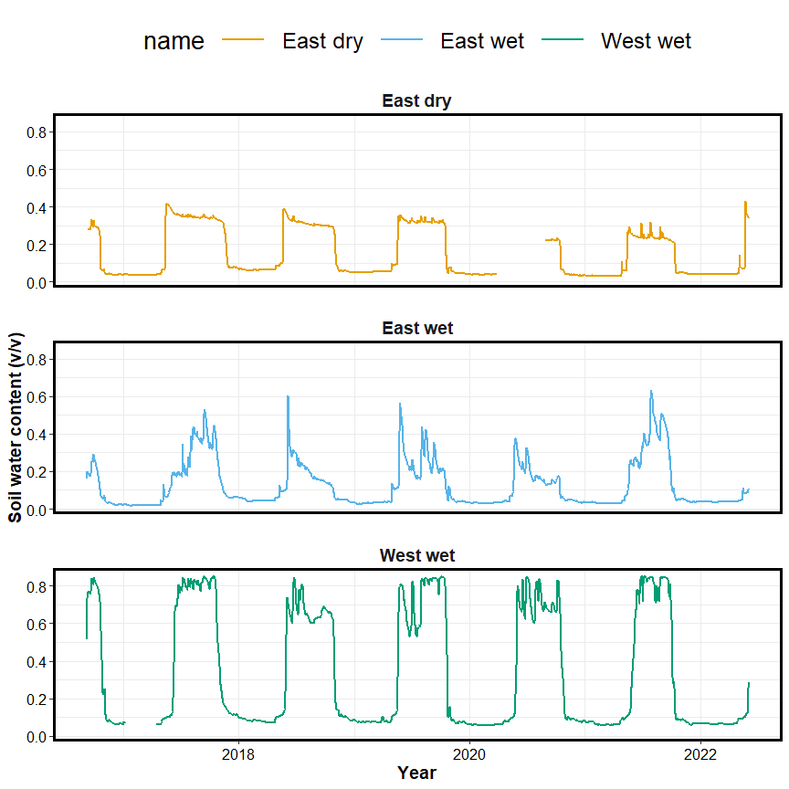
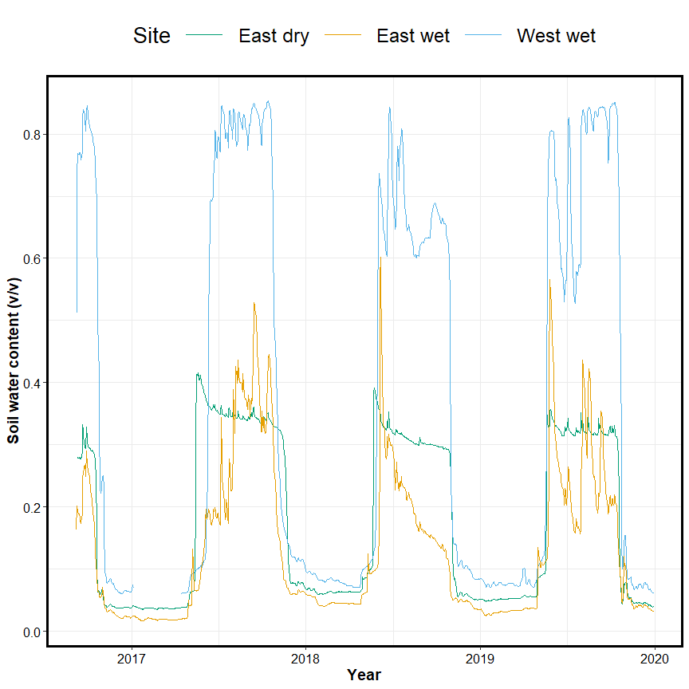
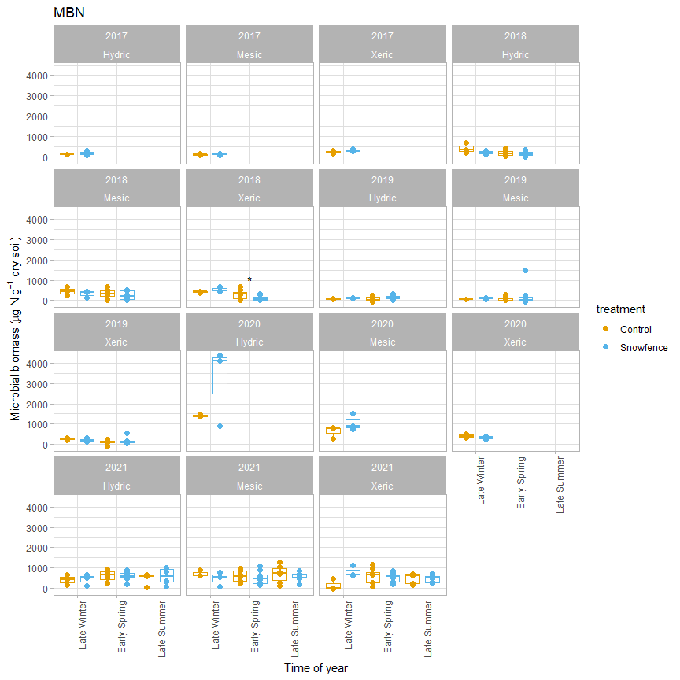
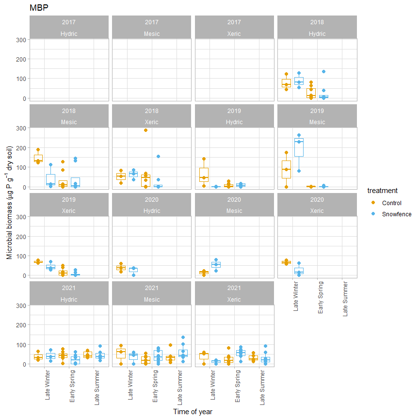
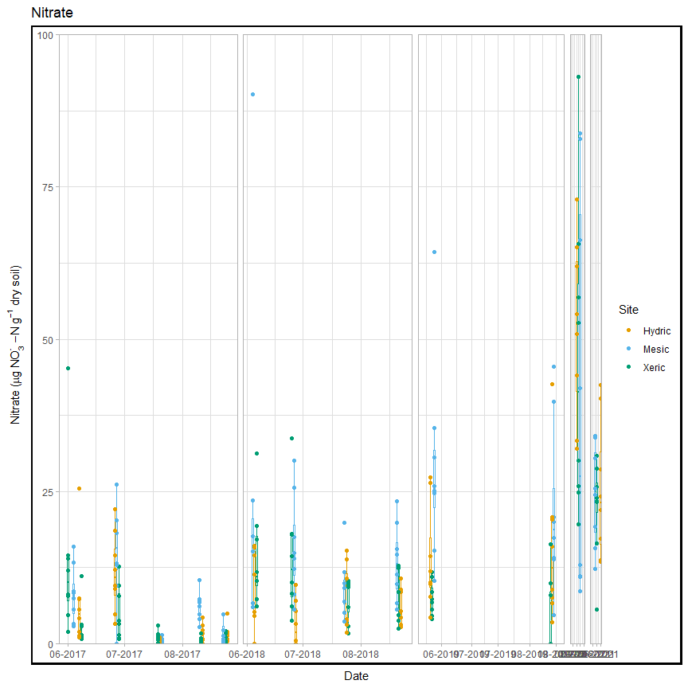
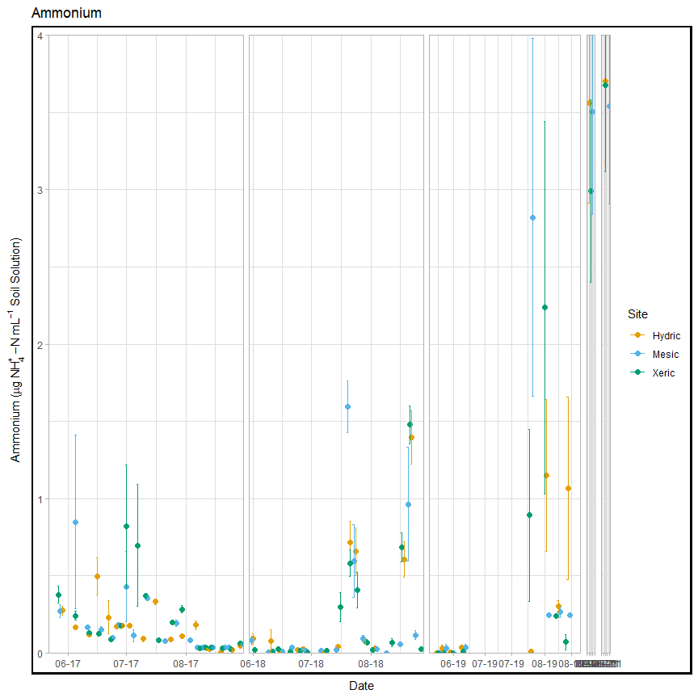
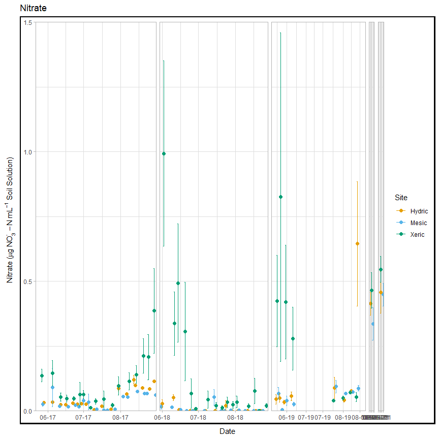
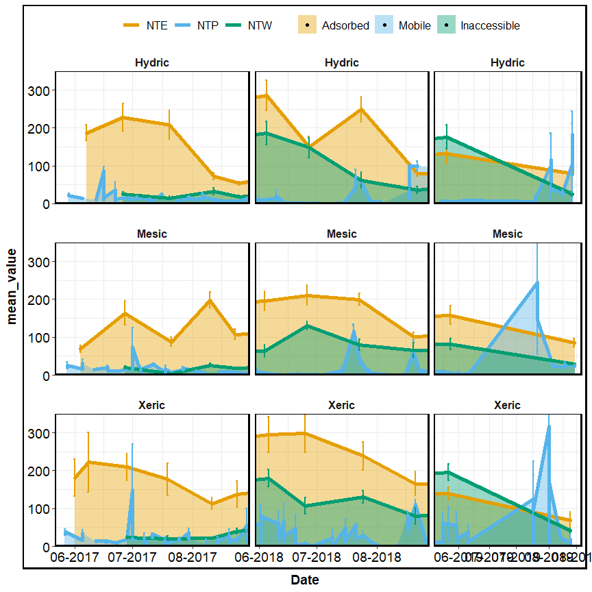

Aggie subset data
================
2023-05-09

## sample summary

click to open

Soils were collected around trees on treelines in the western brooks
range Alaska varying in soil moisture. Three sites were chosen: Tussock
tundra (Mesic), Wet Sedge (Hydric), and Dryas-lichen tundra (Xeric). 8
similar trees were chosen per treatment based on their DBH and proximity
to the treeline. Snow fences were constructed as a treatment to build
larger snow packs around the given trees in winter and compared against
a control group where nothing was done besides sampling. In order to
reduce impact on these tree-plots 8 Ancillary trees were also chosen
based on the same DBH, proximity to treeline parameters and used for
seasonal sampling.  
A previous project conducted at these sites fertilized soils around
similar trees. These soils were also sampled to identify long term
effects of fertilization. Soils were collected from control and
snowfence trees in march and late may/early June (Just after thaw) along
with resin strips (Except in 2020). Soil pore water was taken regularly
during the growing season (2017-2019). During 2019 collection
frequencies reduced due to staffing and were disrupted due to COVID in
2020 with an inability to visit the field sites.

------------------------------------------------------------------------

## Snowfence Vs. Control

click to open

#### Extracts:

K2SO4 No variation in extractable nutrients from snow fence treatment.

click to open

click to open ANOVA results

| analyte | Site   | YEAR | TIME         |   p.value | asterisk |
|:--------|:-------|-----:|:-------------|----------:|:---------|
| MBN     | Xeric  | 2018 | Early Spring | 0.0459993 | \*       |
| PO4     | Mesic  | 2017 | Late Winter  | 0.0005795 | \*       |
| PO4.fum | Mesic  | 2017 | Late Winter  | 0.0014443 | \*       |
| TFPA    | Hydric | 2018 | Early Spring | 0.0124263 | \*       |
| TRS     | Xeric  | 2018 | Early Spring | 0.0015616 | \*       |

| analyte   | Site   | YEAR | TIME         |   p.value | asterisk |
|:----------|:-------|-----:|:-------------|----------:|:---------|
| MBC       | Hydric | 2017 | Late Winter  | 0.9242528 | NA       |
| MBC       | Hydric | 2018 | Early Spring | 0.6309733 | NA       |
| MBC       | Hydric | 2019 | Early Spring | 0.1736374 | NA       |
| MBC       | Mesic  | 2017 | Late Winter  | 0.2351039 | NA       |
| MBC       | Mesic  | 2018 | Early Spring | 0.3767047 | NA       |
| MBC       | Mesic  | 2019 | Early Spring | 0.4034522 | NA       |
| MBC       | Xeric  | 2017 | Late Winter  | 0.8767061 | NA       |
| MBC       | Xeric  | 2018 | Early Spring | 0.0723087 | NA       |
| MBC       | Xeric  | 2019 | Early Spring | 0.5367112 | NA       |
| MBN       | Hydric | 2017 | Late Winter  | 0.4577312 | NA       |
| MBN       | Hydric | 2018 | Early Spring | 0.5318262 | NA       |
| MBN       | Hydric | 2019 | Early Spring | 0.1827473 | NA       |
| MBN       | Mesic  | 2017 | Late Winter  | 0.4644693 | NA       |
| MBN       | Mesic  | 2018 | Early Spring | 0.4257308 | NA       |
| MBN       | Mesic  | 2019 | Early Spring | 0.5062197 | NA       |
| MBN       | Xeric  | 2017 | Late Winter  | 0.2733834 | NA       |
| MBN       | Xeric  | 2018 | Early Spring | 0.0459993 | \*       |
| MBN       | Xeric  | 2019 | Early Spring | 0.3603539 | NA       |
| NH4       | Hydric | 2017 | Late Winter  | 0.4228383 | NA       |
| NH4       | Hydric | 2018 | Early Spring | 0.3189400 | NA       |
| NH4       | Hydric | 2019 | Early Spring | 0.2587825 | NA       |
| NH4       | Mesic  | 2017 | Late Winter  | 0.6445248 | NA       |
| NH4       | Mesic  | 2018 | Early Spring | 0.2476791 | NA       |
| NH4       | Mesic  | 2019 | Early Spring | 0.2868158 | NA       |
| NH4       | Xeric  | 2017 | Late Winter  | 0.1265287 | NA       |
| NH4       | Xeric  | 2018 | Early Spring | 0.1018585 | NA       |
| NH4       | Xeric  | 2019 | Early Spring | 0.3190037 | NA       |
| NO3       | Hydric | 2017 | Late Winter  | 0.7447394 | NA       |
| NO3       | Hydric | 2018 | Early Spring | 0.1286781 | NA       |
| NO3       | Hydric | 2019 | Early Spring | 0.3457828 | NA       |
| NO3       | Mesic  | 2017 | Late Winter  | 0.4303936 | NA       |
| NO3       | Mesic  | 2018 | Early Spring | 0.5627412 | NA       |
| NO3       | Mesic  | 2019 | Early Spring | 0.2782300 | NA       |
| NO3       | Xeric  | 2017 | Late Winter  | 0.2067186 | NA       |
| NO3       | Xeric  | 2018 | Early Spring | 0.5964418 | NA       |
| NO3       | Xeric  | 2019 | Early Spring | 0.5464968 | NA       |
| PO4       | Hydric | 2017 | Late Winter  | 0.6219360 | NA       |
| PO4       | Hydric | 2018 | Early Spring | 0.6332027 | NA       |
| PO4       | Hydric | 2019 | Early Spring | 0.9208946 | NA       |
| PO4       | Mesic  | 2017 | Late Winter  | 0.0005795 | \*       |
| PO4       | Mesic  | 2018 | Early Spring | 0.2821892 | NA       |
| PO4       | Mesic  | 2019 | Early Spring |       NaN | NA       |
| PO4       | Xeric  | 2017 | Late Winter  | 0.2969134 | NA       |
| PO4       | Xeric  | 2018 | Early Spring | 0.1286896 | NA       |
| PO4       | Xeric  | 2019 | Early Spring | 0.2288003 | NA       |
| PO4.fum   | Hydric | 2017 | Late Winter  | 0.3946057 | NA       |
| PO4.fum   | Hydric | 2018 | Early Spring | 0.9225939 | NA       |
| PO4.fum   | Hydric | 2019 | Early Spring | 0.8841150 | NA       |
| PO4.fum   | Mesic  | 2017 | Late Winter  | 0.0014443 | \*       |
| PO4.fum   | Mesic  | 2018 | Early Spring | 0.8352359 | NA       |
| PO4.fum   | Mesic  | 2019 | Early Spring | 0.7492556 | NA       |
| PO4.fum   | Xeric  | 2017 | Late Winter  | 0.5309334 | NA       |
| PO4.fum   | Xeric  | 2018 | Early Spring | 0.3224832 | NA       |
| PO4.fum   | Xeric  | 2019 | Early Spring | 0.2023210 | NA       |
| TFPA      | Hydric | 2017 | Late Winter  | 0.5821164 | NA       |
| TFPA      | Hydric | 2018 | Early Spring | 0.0124263 | \*       |
| TFPA      | Hydric | 2019 | Early Spring | 0.4173300 | NA       |
| TFPA      | Mesic  | 2017 | Late Winter  | 0.0743117 | NA       |
| TFPA      | Mesic  | 2018 | Early Spring | 0.6880129 | NA       |
| TFPA      | Mesic  | 2019 | Early Spring | 0.3348522 | NA       |
| TFPA      | Xeric  | 2017 | Late Winter  | 0.6976218 | NA       |
| TFPA      | Xeric  | 2018 | Early Spring | 0.4146803 | NA       |
| TFPA      | Xeric  | 2019 | Early Spring | 0.2464429 | NA       |
| TN.fum    | Hydric | 2017 | Late Winter  | 0.6137744 | NA       |
| TN.fum    | Hydric | 2018 | Early Spring | 0.9945790 | NA       |
| TN.fum    | Hydric | 2019 | Early Spring | 0.3533706 | NA       |
| TN.fum    | Mesic  | 2017 | Late Winter  | 0.2196318 | NA       |
| TN.fum    | Mesic  | 2018 | Early Spring | 0.4382704 | NA       |
| TN.fum    | Mesic  | 2019 | Early Spring | 0.3518988 | NA       |
| TN.fum    | Xeric  | 2017 | Late Winter  | 0.2101150 | NA       |
| TN.fum    | Xeric  | 2018 | Early Spring | 0.0976950 | NA       |
| TN.fum    | Xeric  | 2019 | Early Spring | 0.7061835 | NA       |
| TN.k2so4  | Hydric | 2017 | Late Winter  | 0.4339124 | NA       |
| TN.k2so4  | Hydric | 2018 | Early Spring | 0.1324980 | NA       |
| TN.k2so4  | Hydric | 2019 | Early Spring | 0.4933220 | NA       |
| TN.k2so4  | Mesic  | 2017 | Late Winter  | 0.2813560 | NA       |
| TN.k2so4  | Mesic  | 2018 | Early Spring | 0.5504293 | NA       |
| TN.k2so4  | Mesic  | 2019 | Early Spring | 0.3198908 | NA       |
| TN.k2so4  | Xeric  | 2017 | Late Winter  | 0.1871344 | NA       |
| TN.k2so4  | Xeric  | 2018 | Early Spring | 0.1557129 | NA       |
| TN.k2so4  | Xeric  | 2019 | Early Spring | 0.3032183 | NA       |
| TOC.fum   | Hydric | 2017 | Late Winter  | 0.4751290 | NA       |
| TOC.fum   | Hydric | 2018 | Early Spring | 0.5239418 | NA       |
| TOC.fum   | Hydric | 2019 | Early Spring | 0.3488814 | NA       |
| TOC.fum   | Mesic  | 2017 | Late Winter  | 0.0835000 | NA       |
| TOC.fum   | Mesic  | 2018 | Early Spring | 0.3804673 | NA       |
| TOC.fum   | Mesic  | 2019 | Early Spring | 0.3234169 | NA       |
| TOC.fum   | Xeric  | 2017 | Late Winter  | 0.5379341 | NA       |
| TOC.fum   | Xeric  | 2018 | Early Spring | 0.1392725 | NA       |
| TOC.fum   | Xeric  | 2019 | Early Spring | 0.9413714 | NA       |
| TOC.k2so4 | Hydric | 2017 | Late Winter  | 0.4555155 | NA       |
| TOC.k2so4 | Hydric | 2018 | Early Spring | 0.1300379 | NA       |
| TOC.k2so4 | Hydric | 2019 | Early Spring | 0.4229420 | NA       |
| TOC.k2so4 | Mesic  | 2017 | Late Winter  | 0.1194345 | NA       |
| TOC.k2so4 | Mesic  | 2018 | Early Spring | 0.4628987 | NA       |
| TOC.k2so4 | Mesic  | 2019 | Early Spring | 0.3520008 | NA       |
| TOC.k2so4 | Xeric  | 2017 | Late Winter  | 0.2140845 | NA       |
| TOC.k2so4 | Xeric  | 2018 | Early Spring | 0.1504672 | NA       |
| TOC.k2so4 | Xeric  | 2019 | Early Spring | 0.2028911 | NA       |
| TRS       | Hydric | 2017 | Late Winter  | 0.5977676 | NA       |
| TRS       | Hydric | 2018 | Early Spring | 0.1616088 | NA       |
| TRS       | Hydric | 2019 | Early Spring | 0.2283456 | NA       |
| TRS       | Mesic  | 2017 | Late Winter  | 0.3575127 | NA       |
| TRS       | Mesic  | 2018 | Early Spring | 0.5151771 | NA       |
| TRS       | Mesic  | 2019 | Early Spring | 0.6518428 | NA       |
| TRS       | Xeric  | 2017 | Late Winter  | 0.8898936 | NA       |
| TRS       | Xeric  | 2018 | Early Spring | 0.0015616 | \*       |
| TRS       | Xeric  | 2019 | Early Spring | 0.4527488 | NA       |
| phenolics | Hydric | 2017 | Late Winter  | 0.7061021 | NA       |
| phenolics | Hydric | 2018 | Early Spring | 0.1059705 | NA       |
| phenolics | Hydric | 2019 | Early Spring | 0.2626072 | NA       |
| phenolics | Mesic  | 2017 | Late Winter  | 0.5096703 | NA       |
| phenolics | Mesic  | 2018 | Early Spring | 0.3014450 | NA       |
| phenolics | Mesic  | 2019 | Early Spring | 0.0971096 | NA       |
| phenolics | Xeric  | 2017 | Late Winter  | 0.5109847 | NA       |
| phenolics | Xeric  | 2018 | Early Spring | 0.8679635 | NA       |
| phenolics | Xeric  | 2019 | Early Spring | 0.6036452 | NA       |

## Microbial biomass

click to open

#### Extracts K2SO4:

Significant changes in microbial biomass over time and between sites,
including a biomass crash observed in 2018, biomass was not seen
increasing again until the end of 2019.

## Resin Strips

click to open

#### resin strip NO3 and PO4 concentrations:

Resin stips showed significant differences between sites. Primary
feature: Xeric contained high NO3, and Mesic contained high PO4. These
differences were not seen in soil extractions, in fact Mesic showed the
highest NO3 extractable concentrations consistently, and Hydric showed
the highest po4 extractable concentrations consistently

click to open

#### Extractable NO3 and PO4 concentrations for comparison:

click to open

## Fertilized plots

click to open

#### Extractions PO4 data:

pore water measurements from fertilized plots showed little variation in
N components, but significantly more PO4 in 2017 and 2018 all season,
with concentrations returning to that of the other plots near the end of
2019 in xeric and mesic. In Hydric concentrations of PO4 in pore water
were also significantly higher in 2017, and at the beginning of 2018 and
return to similar concentrations of other plots at the end of 2018, and
remained similar for 2019.

## FTICR

click to open

#### PCA by Site:

FTICR revealed large differences in organic matter content based on
site, and small variation based on time of year. Mesic contains far more
aromatic, condensed aromatic, and unsaturated lignin compounds (Note
that it does not have the highest concentrations of phenolics). Site
explained \~70% of the variation in FTICR compound diversity, where as
the interaction between Site:year explained \~10% of the variation.

click to open

#### PERMANOVA results

click to open

|             |  Df | SumsOfSqs |   MeanSqs |     F.Model |        R2 | Pr(\>F) |
|:------------|----:|----------:|----------:|------------:|----------:|--------:|
| Site        |   2 | 0.2048378 | 0.1024189 | 109.2342208 | 0.7080634 |   0.001 |
| Year        |   1 | 0.0011243 | 0.0011243 |   1.1990670 | 0.0038862 |   0.274 |
| Season      |   2 | 0.0013712 | 0.0006856 |   0.7312319 | 0.0047399 |   0.493 |
| Site:Year   |   2 | 0.0278093 | 0.0139047 |  14.8299373 | 0.0961286 |   0.001 |
| Site:Season |   3 | 0.0083759 | 0.0027920 |   2.9777402 | 0.0289529 |   0.034 |
| Year:Season |   1 | 0.0007694 | 0.0007694 |   0.8205613 | 0.0026595 |   0.388 |
| Residuals   |  48 | 0.0450052 | 0.0009376 |          NA | 0.1555696 |      NA |
| Total       |  59 | 0.2892930 |        NA |          NA | 1.0000000 |      NA |

Polar PERMANOVA results

|             |  Df |  SumsOfSqs |    MeanSqs |    F.Model |         R2 | Pr(\>F) |
|:------------|----:|-----------:|-----------:|-----------:|-----------:|--------:|
| Site        |   2 |  0.0815983 |  0.0407992 | 95.7669139 |  0.6687323 |   0.001 |
| Year        |   1 |  0.0031369 |  0.0031369 |  7.3631567 |  0.0257082 |   0.016 |
| Season      |   2 |  0.0019339 |  0.0009670 |  2.2697396 |  0.0158494 |   0.121 |
| Site:Year   |   2 |  0.0123377 |  0.0061689 | 14.4800301 |  0.1011128 |   0.001 |
| Site:Season |   3 |  0.0025707 |  0.0008569 |  2.0113723 |  0.0210679 |   0.120 |
| Year:Season |   1 | -0.0000074 | -0.0000074 | -0.0173272 | -0.0000605 |   0.999 |
| Residuals   |  48 |  0.0204492 |  0.0004260 |         NA |  0.1675900 |      NA |
| Total       |  59 |  0.1220194 |         NA |         NA |  1.0000000 |      NA |

Non-Polar PERMANOVA results

In polar and nonpolar sample extracts Site, Site:Year were significant
(p \< 0.05)

Site accounted for \~70 % of total variation among samples Site:Year
accounted for \~10% of total variation among samples

