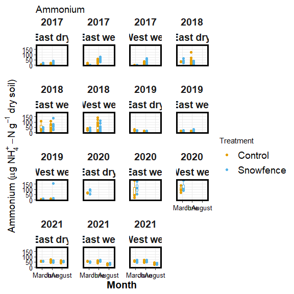
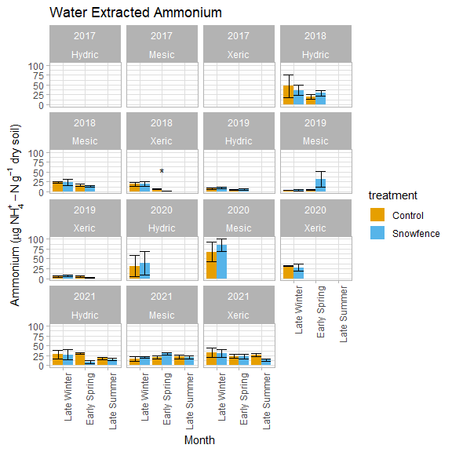
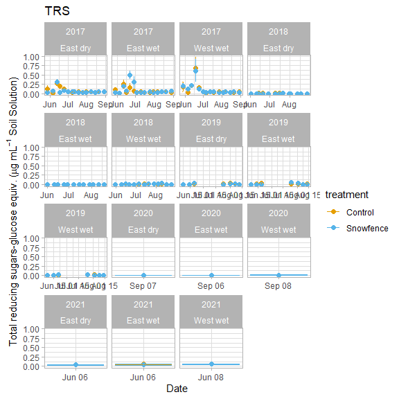
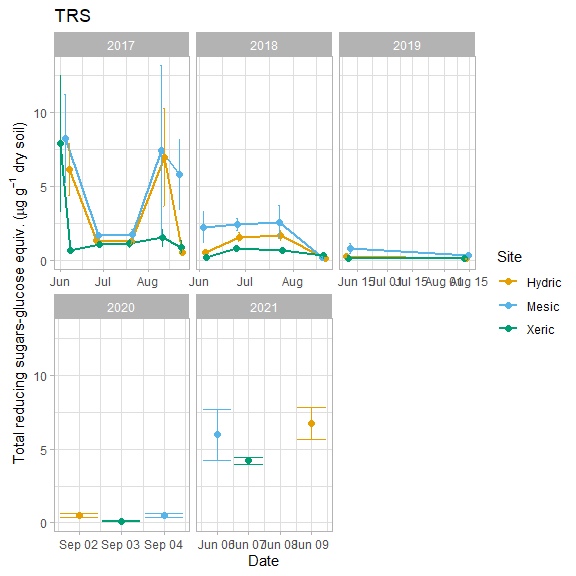
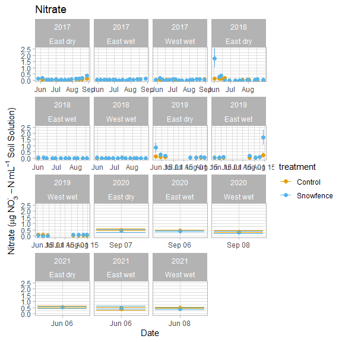

Antecedent temperature experiment
================

## sample summary

click to open

------------------------------------------------------------------------

## Snowfence Vs. Control

click to open

#### Extracts:

K2SO4

click to open

H2O:

click to open

#### Pore water:

click to open

------------------------------------------------------------------------

## Seasonal Extracts and pore water

click to open

#### Extracts:

Due to soil plot concerns only ancillary plots were harvested multiple
times per year. K2SO4:

click to open

H2O:

click to open

#### Pore water:

click to open

------------------------------------------------------------------------

## Destructive lysimeter test

click to open

<!-- --><!-- -->

------------------------------------------------------------------------

## Session Info

Session Info

Date run: 2023-02-24

    ## R version 4.2.2 (2022-10-31 ucrt)
    ## Platform: x86_64-w64-mingw32/x64 (64-bit)
    ## Running under: Windows 10 x64 (build 19045)
    ## 
    ## Matrix products: default
    ## 
    ## locale:
    ## [1] LC_COLLATE=English_United States.utf8 
    ## [2] LC_CTYPE=English_United States.utf8   
    ## [3] LC_MONETARY=English_United States.utf8
    ## [4] LC_NUMERIC=C                          
    ## [5] LC_TIME=English_United States.utf8    
    ## 
    ## attached base packages:
    ## [1] grid      stats     graphics  grDevices utils     datasets  methods  
    ## [8] base     
    ## 
    ## other attached packages:
    ##  [1] lubridate_1.9.0   timechange_0.1.1  ggbiplot_0.55     scales_1.2.1     
    ##  [5] plyr_1.8.8        vegan_2.6-4       lattice_0.20-45   permute_0.9-7    
    ##  [9] forcats_0.5.2     stringr_1.5.0     dplyr_1.0.10      purrr_1.0.0      
    ## [13] readr_2.1.3       tidyr_1.2.1       tibble_3.1.8      ggplot2_3.4.0    
    ## [17] tidyverse_1.3.2   tarchetypes_0.7.4 targets_0.14.2   
    ## 
    ## loaded via a namespace (and not attached):
    ##  [1] nlme_3.1-160        fs_1.5.2            httr_1.4.4         
    ##  [4] future.callr_0.8.1  tools_4.2.2         backports_1.4.1    
    ##  [7] utf8_1.2.2          R6_2.5.1            DBI_1.1.3          
    ## [10] mgcv_1.8-41         colorspace_2.0-3    withr_2.5.0        
    ## [13] tidyselect_1.2.0    processx_3.8.0      compiler_4.2.2     
    ## [16] cli_3.6.0           rvest_1.0.3         xml2_1.3.3         
    ## [19] labeling_0.4.2      callr_3.7.3         digest_0.6.31      
    ## [22] rmarkdown_2.19      pkgconfig_2.0.3     htmltools_0.5.4    
    ## [25] parallelly_1.34.0   highr_0.10          dbplyr_2.2.1       
    ## [28] fastmap_1.1.0       rlang_1.0.6         readxl_1.4.1       
    ## [31] rstudioapi_0.14     farver_2.1.1        generics_0.1.3     
    ## [34] jsonlite_1.8.4      googlesheets4_1.0.1 magrittr_2.0.3     
    ## [37] Matrix_1.5-1        Rcpp_1.0.9          munsell_0.5.0      
    ## [40] fansi_1.0.3         lifecycle_1.0.3     furrr_0.3.1        
    ## [43] stringi_1.7.8       yaml_2.3.6          MASS_7.3-58.1      
    ## [46] parallel_4.2.2      listenv_0.9.0       crayon_1.5.2       
    ## [49] haven_2.5.1         splines_4.2.2       hms_1.1.2          
    ## [52] knitr_1.41          ps_1.7.2            pillar_1.8.1       
    ## [55] igraph_1.3.5        base64url_1.4       codetools_0.2-18   
    ## [58] reprex_2.0.2        glue_1.6.2          evaluate_0.19      
    ## [61] data.table_1.14.6   modelr_0.1.10       vctrs_0.5.1        
    ## [64] tzdb_0.3.0          cellranger_1.1.0    gtable_0.3.1       
    ## [67] future_1.30.0       assertthat_0.2.1    xfun_0.36          
    ## [70] broom_1.0.2         googledrive_2.0.0   gargle_1.2.1       
    ## [73] cluster_2.1.4       globals_0.16.2      ellipsis_0.3.2

