Antecedent temperature experiment
================

## sample summary

click to open

Soils were collected around trees on treelines in the western brooks
range Alaska varying in soil moisture. Three sites were chosen: Tussock
tundra (Mesic), Wet Sedge (Hydric), and Dryas-lichen tundra (Xeric). 8
similar trees were chosen per treatment based on their DBH and proximity
to the treeline. Snow fences were constructed as a treatment to build
larger snow packs around the given trees in winter and compared against
a control group where nothing was done besides sampling. In order to
reduce impact on these tree-plots 8 Ancillary trees were also chosen
based on the same DBH, proximity to treeline parameters and used for
seasonal sampling.  
A previous project conducted at these sites fertilized soils around
similar trees. These soils were also sampled to identify long term
effects of fertilization. Soils were collected from control and
snowfence trees in march and late may/early June (Just after thaw) along
with resin strips (Except in 2020). Soil pore water was taken regularly
during the growing season (2017-2019). During 2019 collection
frequencies reduced due to staffing and were disrupted due to COVID in
2020 with an inability to visit the field sites.

------------------------------------------------------------------------

## Snowfence Vs. Control

click to open

#### Extracts:

K2SO4

click to open

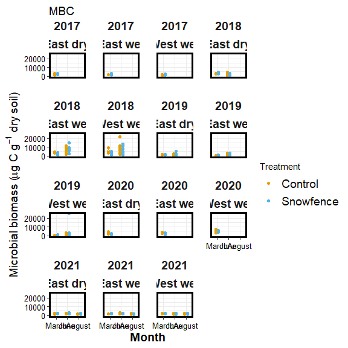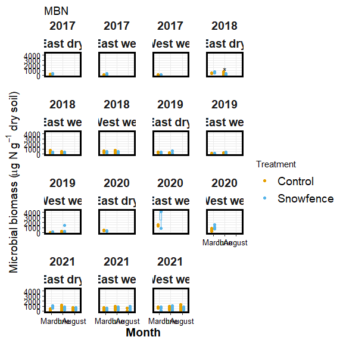

#### H2O:

click to open

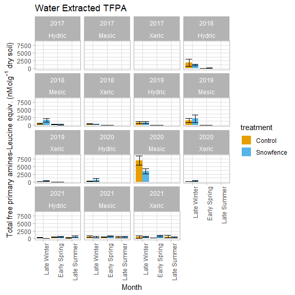

#### Pore water:

click to open

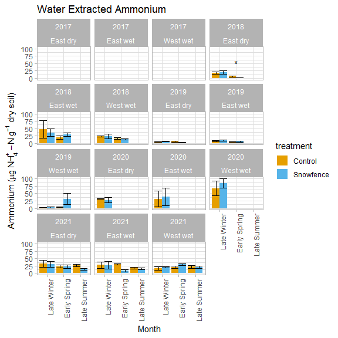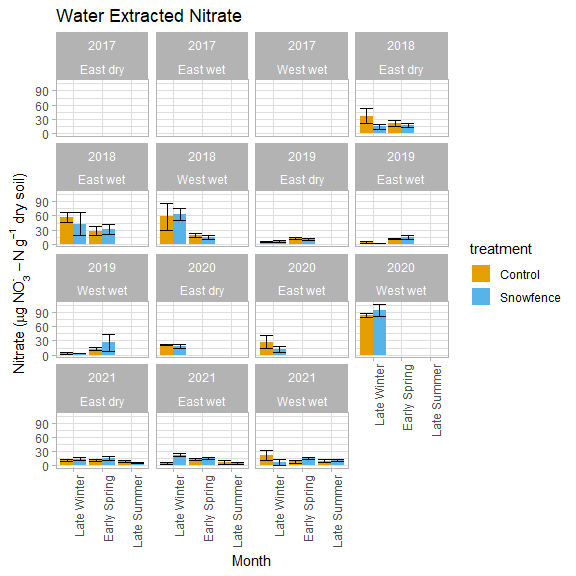

#### Resin strip:

click to open

------------------------------------------------------------------------

## Seasonal Extracts and pore water (Ancillary plots)

click to open

#### Extracts:

Due to soil plot concerns only ancillary plots were harvested multiple
times per year. K2SO4:

click to open

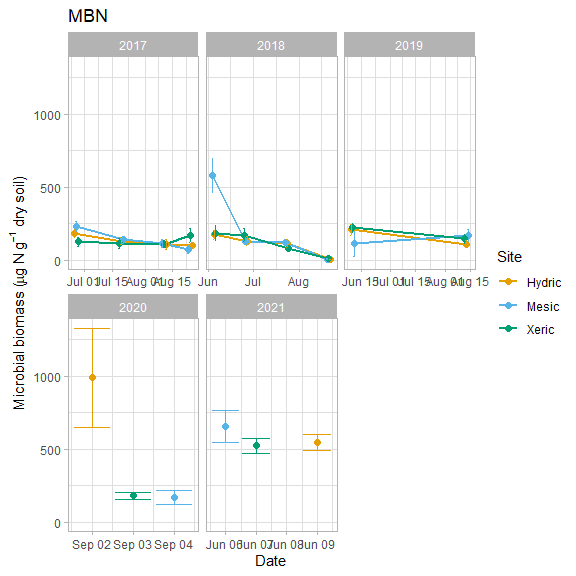

#### H2O:

click to open

#### Pore water:

click to open

#### Resin strip:

click to open

------------------------------------------------------------------------

## Treeline project Extracts and pore water (Ancillary, Control, Snowfence plots)

click to open

#### Extracts:

Due to soil plot concerns only ancillary plots were harvested multiple
times per year. K2SO4:

click to open

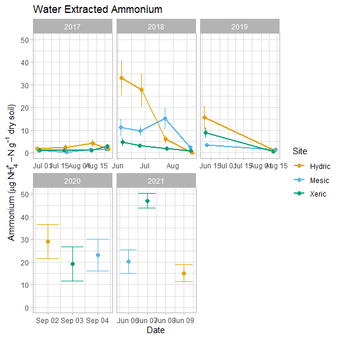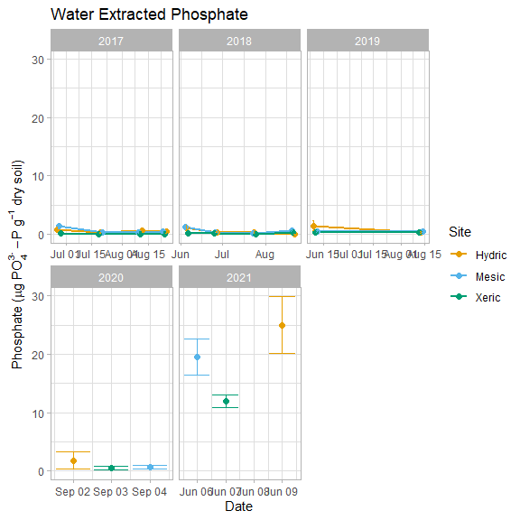

#### H2O:

click to open

#### Pore water:

click to open

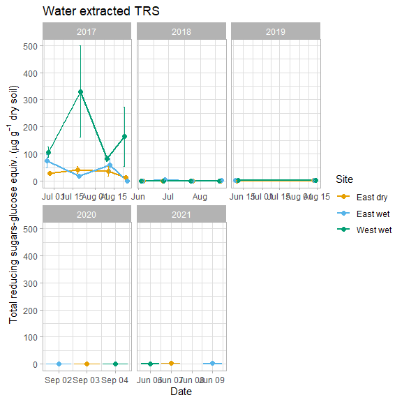

#### Resin strip:

click to open

Resin strips were extracted in 2M KCl

------------------------------------------------------------------------

## All Extracts and pore water (Ancillary, Control, Snowfence, and fertilized plots)

click to open

#### Extracts:

Due to soil plot concerns only ancillary plots were harvested multiple
times per year. K2SO4:

click to open

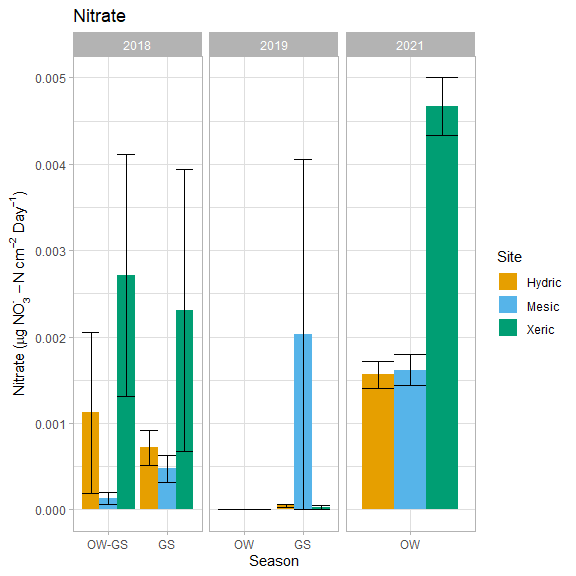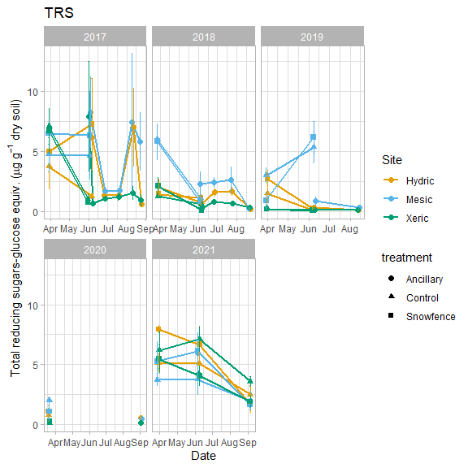

#### H2O:

click to open

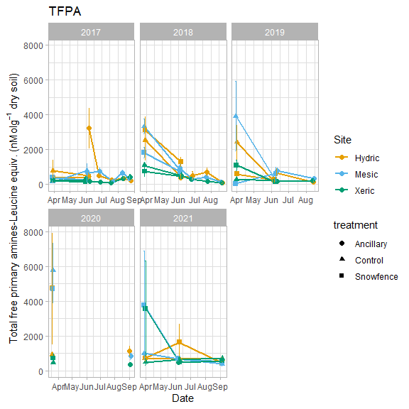

#### Pore water:

click to open

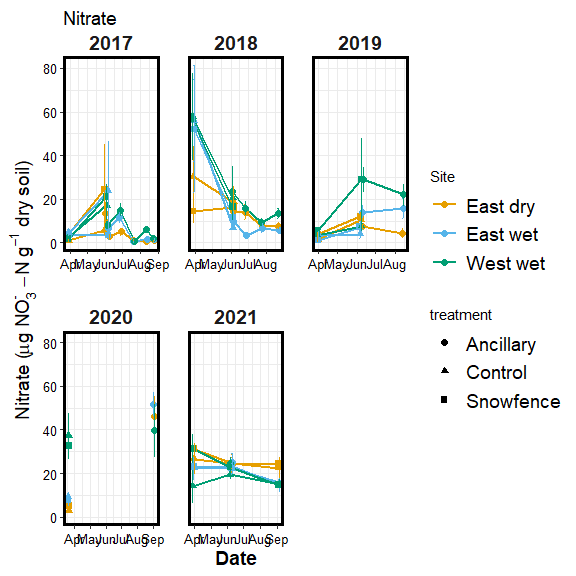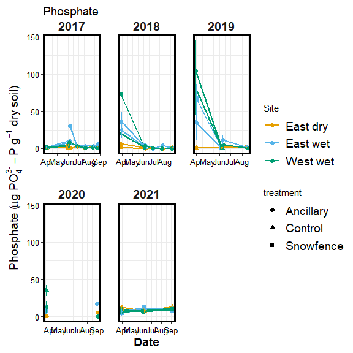

#### Resin strip:

click to open

Resin strips were extracted in 2M KCl

------------------------------------------------------------------------

## Destructive lysimeter test

click to open

#### Pore water:

click to open

<!-- --><!-- -->

#### Extractions

click to open

<!-- --><!-- --><!-- --><!-- --><!-- --><!-- --><!-- --><!-- --><!-- --><!-- --><!-- --><!-- --><!-- --><!-- -->

------------------------------------------------------------------------

## FTICR analysis

click to open

Homogenized soil samples collected in the field in early(end of may
begining of June) and late spring (Late june or early July) from 2017,
2018 and 2019 were sent to EMSL for FTICR analysis.

#### 1. FTICR domains

click to open

<!-- --><!-- -->

#### 2. Comparing polar vs. non-polar extracts

click to open

    ## $vk_polar_nonpolar
    ## TableGrob (13 x 10) "layout": 21 grobs
    ##     z         cells          name                                         grob
    ## 1   0 ( 2-13, 1- 9)    background               rect[plot.background..rect.69]
    ## 2   5 ( 7- 7, 4- 4)        spacer                               zeroGrob[NULL]
    ## 3   7 ( 8- 8, 4- 4)        axis-l           absoluteGrob[GRID.absoluteGrob.41]
    ## 4   3 ( 9- 9, 4- 4)        spacer                               zeroGrob[NULL]
    ## 5   6 ( 7- 7, 5- 5)        axis-t                               zeroGrob[NULL]
    ## 6   1 ( 8- 8, 5- 5)         panel                      gTree[panel-1.gTree.31]
    ## 7   9 ( 9- 9, 5- 5)        axis-b           absoluteGrob[GRID.absoluteGrob.36]
    ## 8   4 ( 7- 7, 6- 6)        spacer                               zeroGrob[NULL]
    ## 9   8 ( 8- 8, 6- 6)        axis-r                               zeroGrob[NULL]
    ## 10  2 ( 9- 9, 6- 6)        spacer                               zeroGrob[NULL]
    ## 11 10 ( 6- 6, 5- 5)        xlab-t                               zeroGrob[NULL]
    ## 12 11 (10-10, 5- 5)        xlab-b titleGrob[axis.title.x.bottom..titleGrob.44]
    ## 13 12 ( 8- 8, 3- 3)        ylab-l   titleGrob[axis.title.y.left..titleGrob.47]
    ## 14 13 ( 8- 8, 7- 7)        ylab-r                               zeroGrob[NULL]
    ## 15 14 ( 8- 8, 5- 5)     guide-box                            gtable[guide-box]
    ## 16 15 ( 5- 5, 5- 5)      subtitle         zeroGrob[plot.subtitle..zeroGrob.65]
    ## 17 16 ( 4- 4, 5- 5)         title            zeroGrob[plot.title..zeroGrob.64]
    ## 18 17 (11-11, 5- 5)       caption          zeroGrob[plot.caption..zeroGrob.67]
    ## 19 18 ( 3- 3, 2- 2)           tag              zeroGrob[plot.tag..zeroGrob.66]
    ## 20 19 ( 1- 1, 5- 5)   topMargPlot                               gtable[layout]
    ## 21 20 ( 8- 8,10-10) rightMargPlot                               gtable[layout]
    ## 
    ## $pca_polar_nonpolar

<!-- -->

Non-polar extracts were strongly dominated by low-O aliphatic molecules
and skewed the overall trends when we combined results from polar and
non-polar extracts. We therefore analyze the two extract types
separately, and focus primarily on the polar (water) extracts.

#### 3. Polar extracts

click to open

###### 3.1. PERMANOVA

click to open

|             |  Df | SumsOfSqs |   MeanSqs |     F.Model |        R2 | Pr(\>F) |
|:------------|----:|----------:|----------:|------------:|----------:|--------:|
| Site        |   2 | 0.2048378 | 0.1024189 | 109.2342208 | 0.7080634 |   0.001 |
| Year        |   1 | 0.0011243 | 0.0011243 |   1.1990670 | 0.0038862 |   0.274 |
| Season      |   2 | 0.0013712 | 0.0006856 |   0.7312319 | 0.0047399 |   0.493 |
| Site:Year   |   2 | 0.0278093 | 0.0139047 |  14.8299373 | 0.0961286 |   0.001 |
| Site:Season |   3 | 0.0083759 | 0.0027920 |   2.9777402 | 0.0289529 |   0.034 |
| Year:Season |   1 | 0.0007694 | 0.0007694 |   0.8205613 | 0.0026595 |   0.388 |
| Residuals   |  48 | 0.0450052 | 0.0009376 |          NA | 0.1555696 |      NA |
| Total       |  59 | 0.2892930 |        NA |          NA | 1.0000000 |      NA |

Site, Site:Year were significant (p \< 0.05)

Site accounted for 71 % of total variation among samples (R2= 0.71)

###### 3.2. PCA

click to open

<!-- -->

There was a strong separation among the three Site/soil types. Hydric
and Xeric soils were strongly dominated by aliphatic (simple) molecules,
whereas Mesic soils were dominated by lignin-like, aromatic, and
condensed aromatic (complex) molecules.

<!-- --><!-- -->

Hydric Only

<!-- -->

###### 3.3. Van Krevelen

click to open

####### 3.3.1. All treatments

click to open

<!-- -->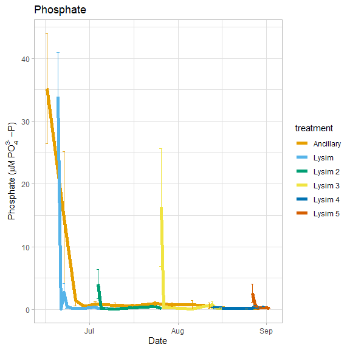<!-- -->

####### 3.3.2. Unique peaks by site

click to open

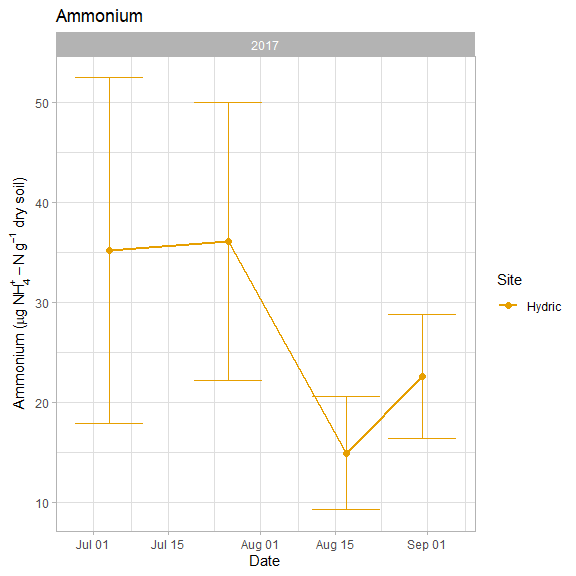<!-- -->

####### 3.3.3. Seasonality Mesic and Hydric

click to open

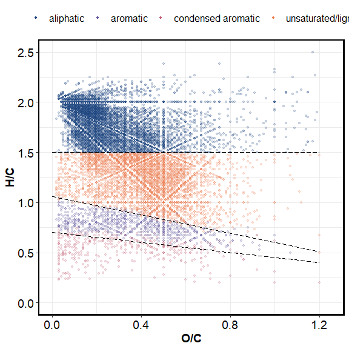<!-- -->

------------------------------------------------------------------------

## Session Info

Session Info

Date run: 2023-03-02

    ## R version 4.2.2 (2022-10-31 ucrt)
    ## Platform: x86_64-w64-mingw32/x64 (64-bit)
    ## Running under: Windows 10 x64 (build 19045)
    ## 
    ## Matrix products: default
    ## 
    ## locale:
    ## [1] LC_COLLATE=English_United States.utf8 
    ## [2] LC_CTYPE=English_United States.utf8   
    ## [3] LC_MONETARY=English_United States.utf8
    ## [4] LC_NUMERIC=C                          
    ## [5] LC_TIME=English_United States.utf8    
    ## 
    ## attached base packages:
    ## [1] grid      stats     graphics  grDevices utils     datasets  methods  
    ## [8] base     
    ## 
    ## other attached packages:
    ##  [1] lubridate_1.9.0   timechange_0.1.1  ggbiplot_0.55     scales_1.2.1     
    ##  [5] plyr_1.8.8        vegan_2.6-4       lattice_0.20-45   permute_0.9-7    
    ##  [9] forcats_0.5.2     stringr_1.5.0     dplyr_1.0.10      purrr_1.0.0      
    ## [13] readr_2.1.3       tidyr_1.2.1       tibble_3.1.8      ggplot2_3.4.0    
    ## [17] tidyverse_1.3.2   tarchetypes_0.7.4 targets_0.14.2   
    ## 
    ## loaded via a namespace (and not attached):
    ##  [1] nlme_3.1-162        fs_1.5.2            httr_1.4.4         
    ##  [4] future.callr_0.8.1  tools_4.2.2         backports_1.4.1    
    ##  [7] utf8_1.2.2          R6_2.5.1            DBI_1.1.3          
    ## [10] mgcv_1.8-41         colorspace_2.0-3    withr_2.5.0        
    ## [13] tidyselect_1.2.0    processx_3.8.0      compiler_4.2.2     
    ## [16] cli_3.6.0           rvest_1.0.3         xml2_1.3.3         
    ## [19] labeling_0.4.2      callr_3.7.3         digest_0.6.31      
    ## [22] rmarkdown_2.19      pkgconfig_2.0.3     htmltools_0.5.4    
    ## [25] parallelly_1.34.0   highr_0.10          dbplyr_2.2.1       
    ## [28] fastmap_1.1.0       rlang_1.0.6         readxl_1.4.1       
    ## [31] rstudioapi_0.14     farver_2.1.1        generics_0.1.3     
    ## [34] jsonlite_1.8.4      googlesheets4_1.0.1 magrittr_2.0.3     
    ## [37] Matrix_1.5-1        Rcpp_1.0.9          munsell_0.5.0      
    ## [40] fansi_1.0.3         lifecycle_1.0.3     furrr_0.3.1        
    ## [43] stringi_1.7.8       yaml_2.3.6          MASS_7.3-58.1      
    ## [46] parallel_4.2.2      listenv_0.9.0       crayon_1.5.2       
    ## [49] haven_2.5.1         splines_4.2.2       hms_1.1.2          
    ## [52] knitr_1.41          ps_1.7.2            pillar_1.8.1       
    ## [55] igraph_1.3.5        PNWColors_0.1.0     base64url_1.4      
    ## [58] codetools_0.2-18    reprex_2.0.2        glue_1.6.2         
    ## [61] evaluate_0.19       data.table_1.14.6   modelr_0.1.10      
    ## [64] vctrs_0.5.1         tzdb_0.3.0          cellranger_1.1.0   
    ## [67] gtable_0.3.1        future_1.30.0       assertthat_0.2.1   
    ## [70] xfun_0.36           broom_1.0.2         googledrive_2.0.0  
    ## [73] gargle_1.2.1        cluster_2.1.4       globals_0.16.2     
    ## [76] ellipsis_0.3.2

