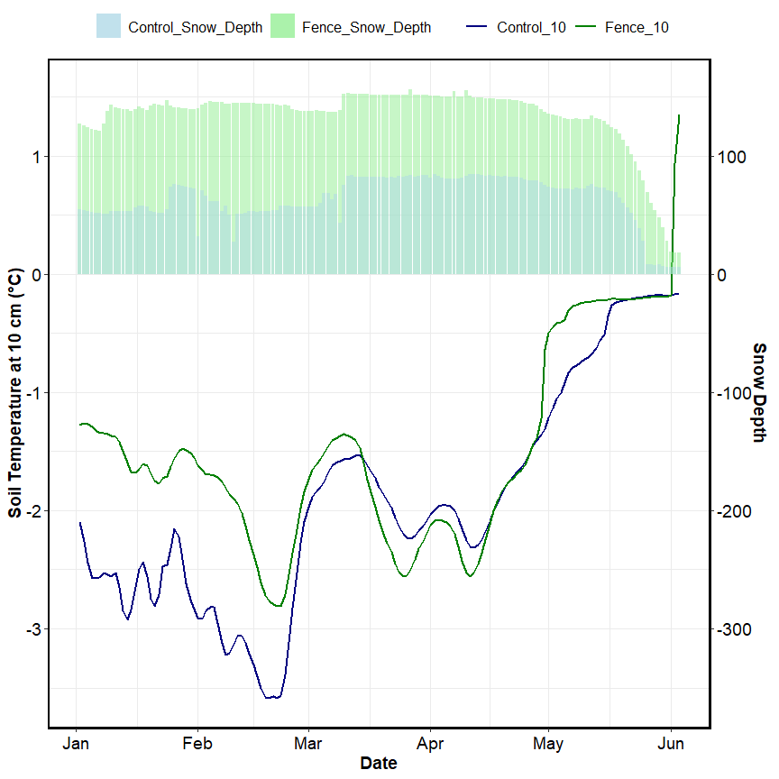
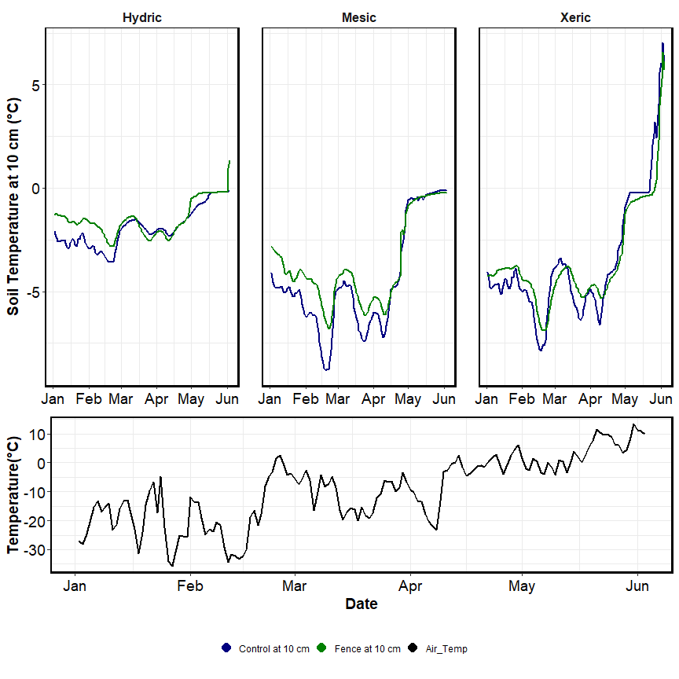

Aggie subset data
================
2023-05-09

## Soil temperature

click to open

## Session Info

Session Info

Date run: 2024-03-19

    ## R version 4.3.2 (2023-10-31 ucrt)
    ## Platform: x86_64-w64-mingw32/x64 (64-bit)
    ## Running under: Windows 11 x64 (build 22631)
    ## 
    ## Matrix products: default
    ## 
    ## 
    ## locale:
    ## [1] LC_COLLATE=English_United States.utf8 
    ## [2] LC_CTYPE=English_United States.utf8   
    ## [3] LC_MONETARY=English_United States.utf8
    ## [4] LC_NUMERIC=C                          
    ## [5] LC_TIME=English_United States.utf8    
    ## 
    ## time zone: America/Los_Angeles
    ## tzcode source: internal
    ## 
    ## attached base packages:
    ## [1] grid      stats     graphics  grDevices utils     datasets  methods  
    ## [8] base     
    ## 
    ## other attached packages:
    ##  [1] cowplot_1.1.1     agricolae_1.3-7   doBy_4.6.20       ggpubr_0.6.0     
    ##  [5] pracma_2.4.4      reshape2_1.4.4    ggbreak_0.1.2     ggExtra_0.10.1   
    ##  [9] lubridate_1.9.3   forcats_1.0.0     stringr_1.5.1     dplyr_1.1.4      
    ## [13] purrr_1.0.2       readr_2.1.4       tidyr_1.3.0       tibble_3.2.1     
    ## [17] tidyverse_2.0.0   ggbiplot_0.55     scales_1.3.0      plyr_1.8.9       
    ## [21] ggplot2_3.4.4     vegan_2.6-4       lattice_0.21-9    permute_0.9-7    
    ## [25] tarchetypes_0.7.9 targets_1.3.2    
    ## 
    ## loaded via a namespace (and not attached):
    ##  [1] rlang_1.1.2           magrittr_2.0.3        compiler_4.3.2       
    ##  [4] mgcv_1.9-0            callr_3.7.3           vctrs_0.6.4          
    ##  [7] pkgconfig_2.0.3       fastmap_1.1.1         backports_1.4.1      
    ## [10] ellipsis_0.3.2        labeling_0.4.3        utf8_1.2.4           
    ## [13] promises_1.2.1        rmarkdown_2.25        tzdb_0.4.0           
    ## [16] ps_1.7.5              xfun_0.41             cachem_1.0.8         
    ## [19] aplot_0.2.2           highr_0.10            later_1.3.1          
    ## [22] Deriv_4.1.3           broom_1.0.5           parallel_4.3.2       
    ## [25] cluster_2.1.4         R6_2.5.1              stringi_1.8.2        
    ## [28] car_3.1-2             Rcpp_1.0.11           knitr_1.45           
    ## [31] PNWColors_0.1.0       httpuv_1.6.12         Matrix_1.6-1.1       
    ## [34] splines_4.3.2         igraph_1.5.1          timechange_0.2.0     
    ## [37] tidyselect_1.2.0      rstudioapi_0.15.0     abind_1.4-5          
    ## [40] yaml_2.3.7            AlgDesign_1.2.1       codetools_0.2-19     
    ## [43] miniUI_0.1.1.1        processx_3.8.2        shiny_1.8.0          
    ## [46] withr_2.5.2           evaluate_0.23         gridGraphics_0.5-1   
    ## [49] pillar_1.9.0          carData_3.0-5         ggfun_0.1.3          
    ## [52] generics_0.1.3        hms_1.1.3             munsell_0.5.0        
    ## [55] xtable_1.8-4          base64url_1.4         glue_1.6.2           
    ## [58] tools_4.3.2           data.table_1.14.8     ggsignif_0.6.4       
    ## [61] fs_1.6.3              colorspace_2.1-0      nlme_3.1-163         
    ## [64] patchwork_1.2.0       cli_3.6.1             fansi_1.0.5          
    ## [67] gtable_0.3.4          rstatix_0.7.2         yulab.utils_0.1.0    
    ## [70] digest_0.6.33         ggplotify_0.1.2       farver_2.1.1         
    ## [73] memoise_2.0.1         htmltools_0.5.7       lifecycle_1.0.4      
    ## [76] mime_0.12             microbenchmark_1.4.10 MASS_7.3-60

