FTICR-MS report
================

## Research questions/hypotheses:

------------------------------------------------------------------------

------------------------------------------------------------------------

## 1. FTICR domains

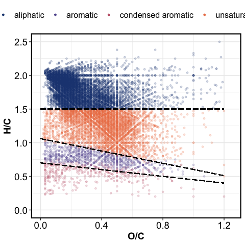<!-- -->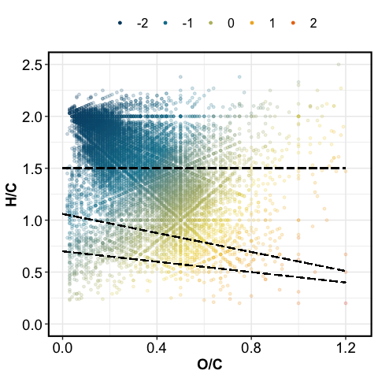<!-- -->

## 2. Comparing polar vs. non-polar extracts

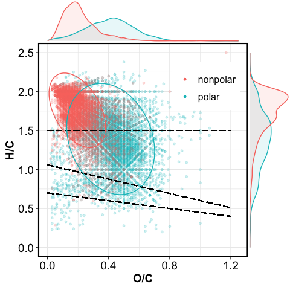<!-- -->

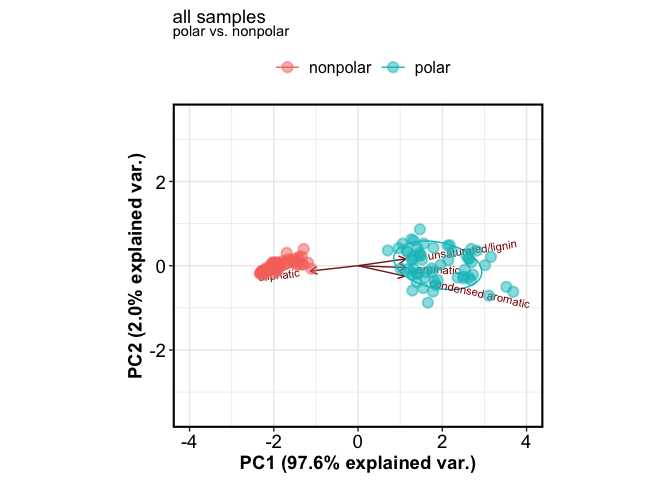<!-- -->

Non-polar extracts were strongly dominated by low-O aliphatic molecules
and skewed the overall trends when we combined results from polar and
non-polar extracts. We therefore analyze the two extract types
separately, and focus primarily on the polar (water) extracts.

------------------------------------------------------------------------

## 3. Polar extracts

### 3.1. PERMANOVA

|             |  Df | SumsOfSqs |   MeanSqs |     F.Model |        R2 | Pr(&gt;F) |
|:------------|----:|----------:|----------:|------------:|----------:|----------:|
| Site        |   2 | 0.2048378 | 0.1024189 | 109.2342208 | 0.7080634 |     0.001 |
| Year        |   1 | 0.0011243 | 0.0011243 |   1.1990670 | 0.0038862 |     0.295 |
| Season      |   2 | 0.0013712 | 0.0006856 |   0.7312319 | 0.0047399 |     0.463 |
| Site:Year   |   2 | 0.0278093 | 0.0139047 |  14.8299373 | 0.0961286 |     0.001 |
| Site:Season |   3 | 0.0083759 | 0.0027920 |   2.9777402 | 0.0289529 |     0.043 |
| Year:Season |   1 | 0.0007694 | 0.0007694 |   0.8205613 | 0.0026595 |     0.377 |
| Residuals   |  48 | 0.0450052 | 0.0009376 |          NA | 0.1555696 |        NA |
| Total       |  59 | 0.2892930 |        NA |          NA | 1.0000000 |        NA |

Site, Site:Year were significant (p &lt; 0.05)

Site accounted for 71 % of total variation among samples (R2= 0.71)

### 3.2. PCA

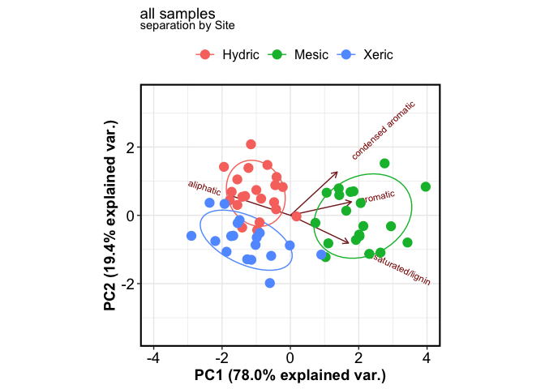<!-- -->

There was a strong separation among the three Site/soil types. Hydric
and Xeric soils were strongly dominated by aliphatic (simple) molecules,
whereas Mesic soils were dominated by lignin-like, aromatic, and
condensed aromatic (complex) molecules.

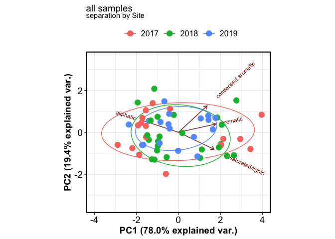<!-- -->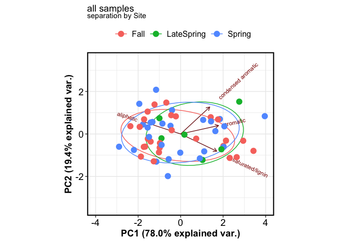<!-- -->

Hydric Only

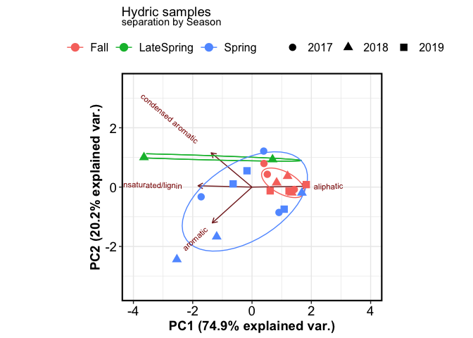<!-- -->

### 3.3. Van Krevelen

#### 3.3.1. All treatments

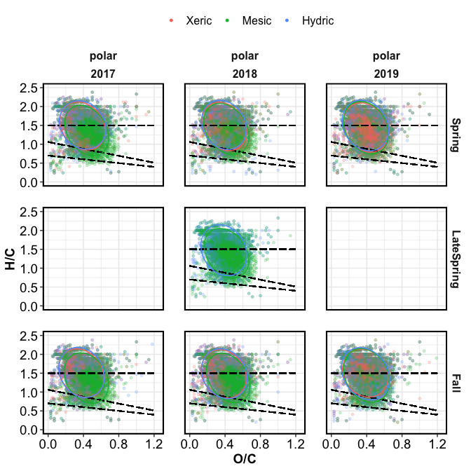<!-- -->

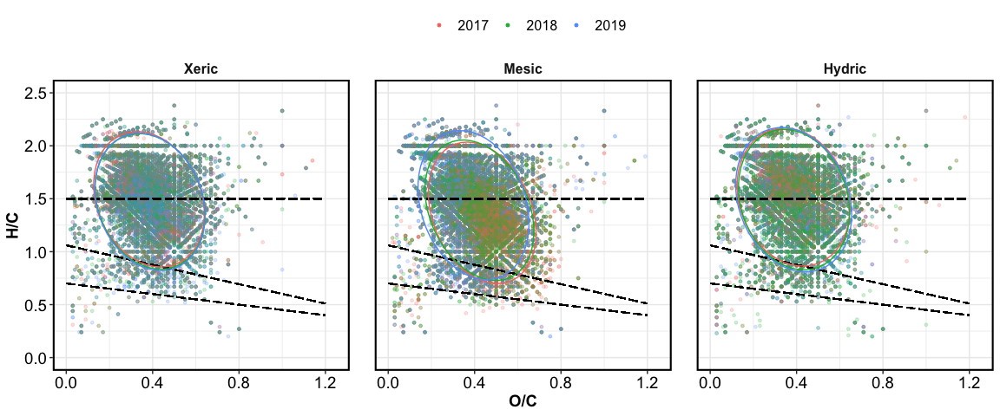<!-- -->

#### 3.3.2. Unique peaks by site

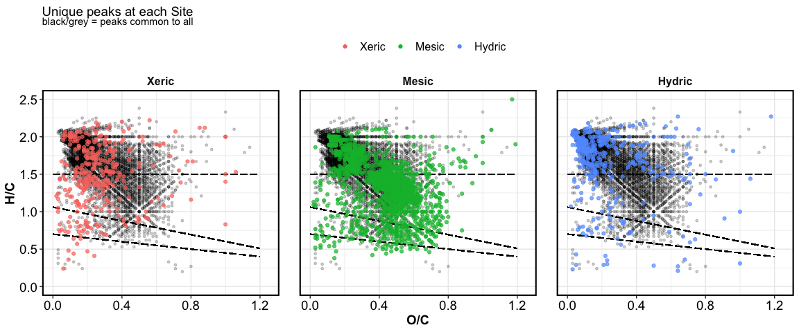<!-- -->

Summary of unique peaks

| Class              | Xeric | Mesic | Hydric |
|:-------------------|------:|------:|-------:|
| aliphatic          |   172 |   483 |    294 |
| aromatic           |    32 |   135 |     22 |
| condensed aromatic |    10 |    65 |     17 |
| unsaturated/lignin |   122 |   703 |     47 |

------------------------------------------------------------------------

#### 3.3.3. Seasonality

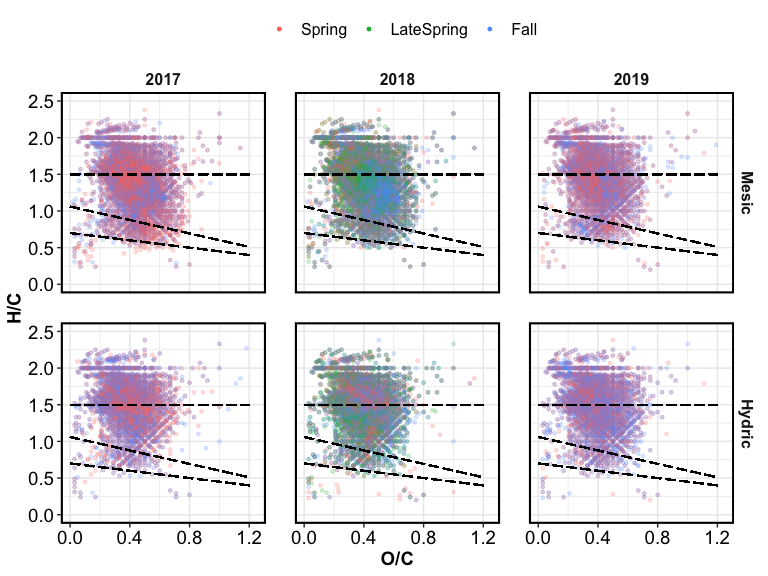<!-- -->

------------------------------------------------------------------------

Session Info

Date run: 2022-05-15

    ## R version 4.1.1 (2021-08-10)
    ## Platform: x86_64-apple-darwin17.0 (64-bit)
    ## Running under: macOS Catalina 10.15.7
    ## 
    ## Matrix products: default
    ## BLAS:   /Library/Frameworks/R.framework/Versions/4.1/Resources/lib/libRblas.0.dylib
    ## LAPACK: /Library/Frameworks/R.framework/Versions/4.1/Resources/lib/libRlapack.dylib
    ## 
    ## locale:
    ## [1] en_US.UTF-8/en_US.UTF-8/en_US.UTF-8/C/en_US.UTF-8/en_US.UTF-8
    ## 
    ## attached base packages:
    ## [1] stats     graphics  grDevices utils     datasets  methods   base     
    ## 
    ## other attached packages:
    ##  [1] ggbiplot_0.55   vegan_2.5-7     lattice_0.20-44 permute_0.9-5  
    ##  [5] forcats_0.5.1   stringr_1.4.0   dplyr_1.0.7     purrr_0.3.4    
    ##  [9] readr_2.0.2     tidyr_1.1.4     tibble_3.1.5    ggplot2_3.3.5  
    ## [13] tidyverse_1.3.1
    ## 
    ## loaded via a namespace (and not attached):
    ##  [1] httr_1.4.2       jsonlite_1.7.2   splines_4.1.1    modelr_0.1.8    
    ##  [5] shiny_1.7.1      assertthat_0.2.1 highr_0.9        cellranger_1.1.0
    ##  [9] yaml_2.2.1       pillar_1.6.2     backports_1.2.1  glue_1.4.2      
    ## [13] digest_0.6.27    promises_1.2.0.1 rvest_1.0.1      colorspace_2.0-2
    ## [17] httpuv_1.6.2     htmltools_0.5.2  Matrix_1.3-4     plyr_1.8.6      
    ## [21] pkgconfig_2.0.3  broom_0.7.10     haven_2.4.3      xtable_1.8-4    
    ## [25] scales_1.1.1     later_1.3.0      tzdb_0.1.2       mgcv_1.8-36     
    ## [29] generics_0.1.0   farver_2.1.0     ellipsis_0.3.2   withr_2.4.2     
    ## [33] cli_3.0.1        mime_0.11        magrittr_2.0.1   crayon_1.4.1    
    ## [37] readxl_1.3.1     evaluate_0.14    fs_1.5.0         fansi_0.5.0     
    ## [41] nlme_3.1-153     MASS_7.3-54      xml2_1.3.2       tools_4.1.1     
    ## [45] hms_1.1.0        lifecycle_1.0.0  munsell_0.5.0    reprex_2.0.1    
    ## [49] cluster_2.1.2    compiler_4.1.1   PNWColors_0.1.0  rlang_0.4.11    
    ## [53] grid_4.1.1       rstudioapi_0.13  miniUI_0.1.1.1   labeling_0.4.2  
    ## [57] rmarkdown_2.11   gtable_0.3.0     DBI_1.1.1        R6_2.5.1        
    ## [61] lubridate_1.8.0  knitr_1.36       fastmap_1.1.0    utf8_1.2.2      
    ## [65] ggExtra_0.9      stringi_1.7.5    parallel_4.1.1   Rcpp_1.0.8      
    ## [69] vctrs_0.3.8      dbplyr_2.1.1     tidyselect_1.1.1 xfun_0.25

